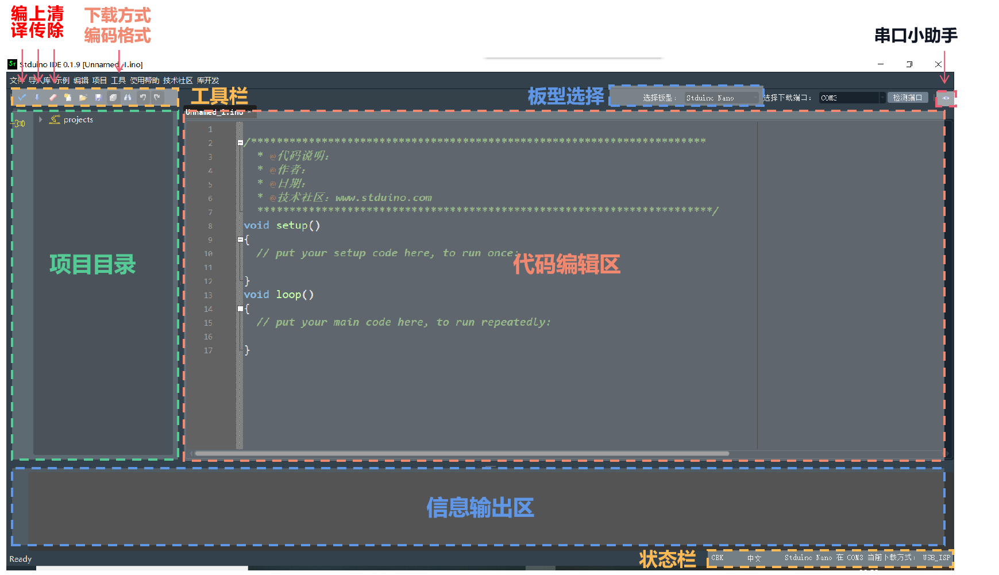

.. Astilbe documentation master file, created by
   sphinx-quickstart on Sun Feb  2 12:36:51 2020.
   You can adapt this file completely to your liking, but it should at least
   contain the root `toctree` directive.

Hello!
===================================

欢迎使用Stduino
+++++++++++++++

Stduino简介
==========
Stduino是基于C/C++封装的微控制器开发语言，它可以助您高效开发包括STM32F103系列在内的微控制器，为您省去大量琐碎的底层操作，从而把时间用在更重要的地方。

软件简介
========
Stduino IDE是一款针对32位处理器芯片的集成开发工具，当前已经完成了对STM32F103C8T6芯片的适配，\
后续将逐一对STM32F系列芯片进行适配；该开发工具为提高代码运行效率，核心底层库函数80%以上直接基于寄存器进行封装；\
同时兼具Arduino语法函数所有特点，还实现了 ``代码自动补全提示`` ， ``中英文模式`` ， ``UTF-8\GBK编码格式`` ， ``一键格式化`` ， ``一键St-link\串口下载方式`` 等相关功能，极大地降低了STM32F103C8T6芯片的入门学习及后续开发成本。\
最后封装库将采用开源共享的理念进行分发，一处分享全球共用，极大保障后续软件维护的动力支撑。\

- Win版软件无需安装，下载解压后，双击Stduino.exe即可运行。
- Mac&Linux版软件正在开发中~

教程说明
===========
Stduino是一个基于易用硬件和软件的原型平台(开源)。它包括可编程的电路板（简称微控制器）和称为Stduino IDE（集成开发环境）的现成软件组成，用于将计算机代码烧入微控制器。\
Stduino目前主要支持ST（意法半导体）32位芯片开发。在开始教程之前，您需要提前安装Stduino IDE。

Stduino快速开发教程
==================

.. toctree::
	:maxdepth: 3
	
	
	FUNCTION/chart1
	Computation/chart2
	Variable/varIndex
	chart4
	workDiary
	
   

访问\ `Stduino官网 <http://stduino.com/forum.php>`_ ，了解更多Stduino动态

